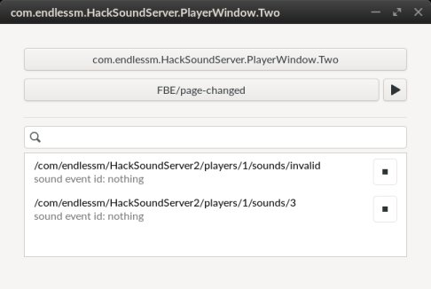

# HackSoundServer Tools

Contains a tools useful to test the HackSoundServer project.

## Tools

### PlayerWindow Application
This is an application with a GUI that allows to play and stop sounds using the HackSoundServer2 API. It was developed mainly to test the focus feature when it gets implemented in the server. The following features have been considered:

- Is hackable, so it should be possible to test the Focus feature when flipping back the application.
- Can have multiple instances of the application with different application ids *(or well-known-names)*, so one could test the focus feature when alternating the focus among multiple apps or can test 
- Allows to play a sound on behalf another application id *(or well-known-name)*.
- Tracks the current sound object paths that have been created.

#### Installation instructions:

You can install the application by running the following command.

    APP_ID_SUFIX=Two ./com.endlessm.HackSoundServer.PlayerWindow/tools/build-local-flatpak.sh --install

The specification `APP_ID_SUFIX` environment variable will help ot build the full id of the application. For this example, the application will be installed with this app id: *com.endlessm.HackSoundServer.PlayerWindow.**Two***. So setting a different value for the `APP_ID_SUFIX` would build an application with a different bus name.

#### Troubleshooting
- The application won't flip: *If not possible to flip the application to the backside, it may be because you do not have a HackToolbox with a PlayerWindow toolbox installed.*
- The application blocks before showing up: *Check the HackSoundServer2 is running. Try `pkill -f /com/endlessm/hack-sound-server` and `flatpak run com.endlessm.HackSoundServer --api-version=2`, then run the application again*.

#### Usage
***Specifying the player on behalf.***
1. Click the button with the default bus name. A popover will open.
2. Type the application id and click the check button.

***Select the sound event id to play:***
1. Click the second button, and a popover will open listing all the available sound event ids in the metadata file.
2. Search a sound event id by typing into the search entry.
3. Click a sound from the list. 

***See the properties of a sound event id:***
1. Click the seconStop a sound:d button, and a popover will open listing all the available sound event ids in the metadata file.
2. Put the cursor over an item in the list of sound event ids, and a tool-tip will be displayed showing up the sound properties.

***Play a sound:***
1. Having specified the player, click the play button.
*Note: In the server side, the player object will be created when clicking on the play button.*
If everything okay, a list of the current sounds will be displayed.

***Stop (unreferring) a sound:***
1. In the list of current sounds, click on the stop button.
*Note: You should click as many times you click on the play button to actually stop the sound.*

#### Future
It is expected in the future to support other HackSoundServer2 methods, like `PlayFull`, `Terminate`, `UpdateProperties` and support the creation of a different player with a differnt set of options.
